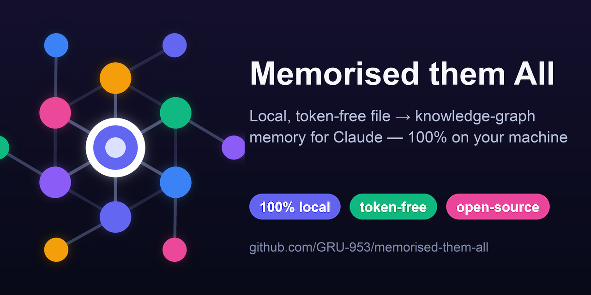

<div align="center">



<h1>Memorised them All</h1>

<h3>Local, token-free document memory for Claude — turn any folder of files into a knowledge graph you can recall, for ~0 context tokens.</h3>

<p>An <a href="https://modelcontextprotocol.io">MCP</a> server &amp; plugin for <b>Claude Desktop</b> and <b>Claude Code</b> that converts PDFs, Office docs, images, and audio to Markdown <b>on your machine</b>, then digests them into a searchable <b>knowledge graph</b> + <b>mind map</b> — privately, with no cloud and no API keys.</p>

[](https://github.com/GRU-953/memorised-them-all/actions/workflows/ci.yml)
[](https://github.com/GRU-953/memorised-them-all/releases/latest)
[](https://pypi.org/project/memorised-them-all/)
[](https://pypi.org/project/memorised-them-all/)
[](https://pypi.org/project/memorised-them-all/)
[](LICENSE)
[](#-platform-support)
[](#-why-token-free)

<p>
<a href="#-quickstart"><b>Quickstart</b></a> ·
<a href="#-why-token-free">Why token-free</a> ·
<a href="#-features">Features</a> ·
<a href="#-how-it-works">How it works</a> ·
<a href="#-tools">Tools</a> ·
<a href="#-use-cases">Use cases</a> ·
<a href="#-comparison">Comparison</a> ·
<a href="#-configuration">Config</a> ·
<a href="#-platform-support">Platforms</a> ·
<a href="#-privacy--security">Privacy</a> ·
<a href="#-faq">FAQ</a>
</p>

**100% local · free &amp; open-source · auto-installing · Apple-silicon optimised · by [GRU-953](https://github.com/GRU-953)**

</div>

---

> **The idea in one line:** Claude tokens are expensive; your computer's compute is free. So every heavy step — converting documents, extracting knowledge, embedding, summarising — runs **locally**, and Claude only ever gets back a tiny tool result. Digesting a 500-page folder costs **roughly zero context tokens**.

Point **Memorised them All** at a folder. It converts every attachment to Markdown locally, then builds a layered **knowledge graph** — a global synopsis, per-theme summaries, per-document notes, an exportable Markdown bundle, and an offline interactive **mind map** — and lets Claude recall from it for next to nothing.

```
"Memorise everything in ~/Documents/research."
"What did my documents say about the Q3 budget?"
"Open the mind map."
```

## 🚀 Quickstart

<table>
<tr><th>Claude Desktop</th><th>Claude Code</th></tr>
<tr><td>

Download **`memorised-them-all.mcpb`** from the
[latest release](https://github.com/GRU-953/memorised-them-all/releases/latest)
and double-click it (**Settings → Extensions**). It bootstraps the local stack on first launch.

</td><td>

```bash
/plugin marketplace add GRU-953/memorised-them-all
/plugin install memorised-them-all
```

</td></tr>
<tr><th>pip (any OS)</th><th>Homebrew (macOS/Linux)</th></tr>
<tr><td>

```bash
pip install memorised-them-all
mta status
mta digest ~/Documents/research
```

</td><td>

```bash
brew install GRU-953/memorised-them-all/mta
```

</td></tr>
</table>

> **Requirements:** Python ≥ 3.10. The installer fetches everything else (Ollama, Tesseract, ffmpeg, the latest MarkItDown, and local models) — see [Platform support](#-platform-support).

## 💡 Why token-free

Most "chat with your documents" tools stream document text into the model — you pay tokens to **ingest** *and* to **recall**. Memorised them All never does that:

| Step | Where it runs | Tokens to Claude |
| --- | --- | --- |
| Convert PDF / Office / image / audio → Markdown | your machine (MarkItDown · Tesseract · Whisper · Ollama) | **0** |
| Extract entities · relations · facts | your machine (local LLM, classical fallback) | **0** |
| Embed · resolve · build graph · summarise | your machine (Ollama · NetworkX) | **0** |
| **`digest` result** | — | counts &amp; paths only (~140 tokens) |
| **`recall` result** | — | a small, citable slice — **never the documents** |

Tool results are hard-capped in size, so the guarantee holds even on the high-accuracy path.

## ✨ Features

- 📄 **Universal local conversion** — PDF, Word, Excel, PowerPoint, HTML, EPub, Outlook `.msg`, CSV/JSON/XML, images (OCR + vision captioning), and audio (on-device transcription) → clean Markdown. Scanned PDFs are OCR'd; up to 163 OCR languages (with the Tesseract language packs installed).
- 🕸️ **Layered knowledge graph (GraphRAG-style)** — entities, typed relations and atomic facts, grouped into **themes** by community detection, with a global synopsis and per-theme summaries — all built by local models.
- 🧭 **Offline interactive mind map** — a single self-contained `mindmap.html` (Cytoscape inlined, zero network).
- 📝 **Exportable, portable memory** — `graph.json`, `memory.md`, and per-document notes you can copy to any machine and reuse.
- ⚡ **Two modes** — high-accuracy (local LLM) and **fast mode** (`--fast`): deterministic and often 20–100× faster (scales with corpus size) for large or frequently-refreshed corpora.
- 🔁 **Reusable named projects** — accumulate many folders into one memory; `forget` to delete one.
- 🍎 **Apple-silicon first** — performance-core parallelism, GPU Whisper via MLX, unified-memory-aware concurrency. Runs on Intel macOS, Linux, and Windows too.
- ⚙️ **Auto-installing & auto-updating** — pulls the latest MarkItDown from upstream; starts the model server on demand and **stops it after 5 minutes idle**.
- 🌍 **Multilingual** — Unicode-aware entity resolution (Bengali, CJK, Cyrillic, accented Latin) and OCR in many languages.
- 🛟 **Crash-safe & reusable** — memory is written atomically, so an interrupted digest never corrupts an existing project; recall reports a `low_confidence` signal so Claude can decline when the answer isn't in your docs.
- 🔒 **Private by design** — no cloud, no API keys, no telemetry. Your files never leave your computer.

## 🧠 How it works

```
attachments ─► CONVERT ─► SEGMENT ─► EMBED ─► EXTRACT ─► RESOLVE ─► GRAPH + COMMUNITIES ─► MATERIALISE
  pdf/docx/   MarkItDown  structure  nomic-   local LLM  canonical  NetworkX +             graph.json
  xlsx/img/   +Tesseract  +semantic  embed-   triples +  entities   Leiden / Louvain        memory.md
  audio/...   +Whisper    chunking   text     facts      (embed +   community summaries     memory/<doc>.md
              +Ollama                          (+class-   fuzzy +    (local LLM)             mindmap.html
               vision                           ical      acronym)                           vectors store
                                                fallback)
                                                                              │
   recall("…")  ◄── embed query locally ──  return ONLY a small, citable slice (themes + facts + provenance)
```

Everything between *attachments* and *recall* happens on your machine. The local-LLM step has a **dependency-free classical fallback**, so a digest always succeeds — even offline, even before any model is downloaded — and gets sharper once models are present.

## 🛠 Tools

Eight token-free MCP tools (plus the `mta` CLI). Every result is metadata or a small slice — **document contents never return to the conversation**.

| Tool | What it does |
| --- | --- |
| `digest(paths, project?, reset?, fast?)` | convert + digest files/dirs/globs; **accumulates** into the project (`reset` starts fresh, `fast` skips the LLM) |
| `recall(query, project?, k?)` | answer from memory — a small, citable slice (+ `top_score` &amp; `low_confidence` relevance signal) |
| `memory_overview(project?)` | synopsis + themes |
| `export_memory(dest, project?)` | export portable Markdown + graph + mind map |
| `list_digestible(directory)` | list convertible files (paths/sizes only) |
| `memory_status()` | local stack health (Ollama, models, Tesseract, MarkItDown version) |
| `open_mindmap(project?)` | path to the offline interactive mind map |
| `forget(project?)` | delete a project's memory |

**CLI:** `mta digest <paths> [--fast] [--reset]` · `mta recall "<q>"` · `mta overview` · `mta export <dir>` · `mta mindmap --open` · `mta forget` · `mta status` · `mta update`. In Claude Code, the slash commands `/memorise`, `/recall`, `/memory-map`, `/memory-status`, `/export-memory` are also available.

## 🎯 Use cases

- **Private RAG / "chat with your documents" — locally**, with no cloud and no per-query token cost.
- **Research & literature memory** — digest a folder of papers/PDFs and ask grounded questions.
- **Knowledge base for an agent** — give Claude durable, reusable memory across sessions.
- **Meeting & audio notes** — transcribe recordings on-device and fold them into the graph.
- **Scanned documents & receipts** — OCR image-only PDFs and images into searchable memory.
- **Visual exploration** — open the offline mind map to see how entities and themes connect.

## ⚖️ Comparison

| | **Memorised them All** | Cloud "chat with docs" / hosted RAG | Stock `markitdown-mcp` |
| --- | :---: | :---: | :---: |
| Runs fully locally | ✅ | ❌ | ✅ (conversion only) |
| Context-token cost to ingest **and** recall | **~0** | high | high (returns text) |
| Knowledge graph + themes | ✅ | sometimes | ❌ |
| Offline interactive mind map | ✅ | ❌ | ❌ |
| Works offline / no API keys | ✅ | ❌ | ✅ |
| Reusable, exportable memory files | ✅ | varies | ❌ |
| Free &amp; open-source (MIT) | ✅ | varies | ✅ |

## ⚙️ Configuration

All optional, sensible defaults; set via environment (CLI) or the extension settings (Desktop).

| Variable | Default | Meaning |
| --- | --- | --- |
| `MTA_HOME` | `~/.memorised-them-all` | where memories are stored |
| `MTA_FAST` | `off` | fast mode — skip the LLM (deterministic, often 20–100× faster) |
| `MTA_EXTRACT_MODEL` | `qwen2.5:7b` | local LLM for extraction & summaries |
| `MTA_EMBED_MODEL` | `nomic-embed-text` | local embedding model |
| `MTA_VISION_MODEL` | `moondream` | image captioning |
| `MTA_OCR_LANG` | `eng` | Tesseract languages, e.g. `eng+ben` |
| `MTA_WHISPER_MODEL` | `base` | on-device transcription model |
| `MTA_IDLE` | `300` | seconds idle before Ollama is stopped |
| `MTA_WORKERS` / `MTA_EXTRACT_WORKERS` | `0` (auto) | parallel conversion / extraction workers |
| `MTA_MAX_CHUNKS` / `MTA_MAX_FILE_MB` | `1500` / `200` | workload &amp; input-size caps (reported) |
| `MTA_RECALL_MIN_SCORE` | `0` (off) | drop recall hits below this cosine score (stricter grounding) |
| `MTA_AUTO_UPDATE` | `on` | auto-update MarkItDown &amp; dependencies |
| `MTA_NO_OLLAMA` | unset | hard offline switch (classical + hashing) |

## 💻 Platform support

Apple M-series is the primary, most-optimised target; other platforms use portable fallbacks.

| Platform | Status | Notes |
| --- | --- | --- |
| macOS (Apple silicon) | ✅ optimised | performance-core pool, MLX GPU Whisper, unified-memory-aware |
| macOS (Intel) | ✅ supported | physical-core sizing via psutil, CPU Whisper |
| Linux | ✅ supported | apt/dnf/pacman install paths, CUDA Whisper if a GPU is present |
| Windows | 🧪 experimental | `pip install memorised-them-all` + `mta serve` (or `python launch.py`). The `.mcpb` bundle is macOS/Linux only. |

CI runs the test suite across **Ubuntu, macOS, and Windows** on Python 3.10 &amp; 3.12.

## 📦 Generated files &amp; reuse

Each project under `MTA_HOME/projects/<name>/` is self-contained and portable:

| File | What it is |
| --- | --- |
| `graph.json` | source of truth — nodes, edges, communities, layered summaries (version-stamped, no absolute paths) |
| `memory.md` | compact, layered digest for reading / pasting |
| `memory/<doc>.md` | one note per source document |
| `mindmap.html` | offline interactive graph (Cytoscape inlined) |
| `vectors.npz` + `vectors.json` | local embeddings for recall |

A memory built once can be **copied to another machine** and reused read-only. `export_memory` bundles all of the above (including the vector store) into a folder you choose.

## 🔒 Privacy &amp; security

100% local — no cloud APIs, no telemetry, no API keys. Your documents, the graph, the embeddings, and the memory files never leave your machine. The only network access is (a) downloading open-source dependencies/models on install and (b) a throttled once-a-day dependency-update check (disable with `MTA_AUTO_UPDATE=off`).

Hardened for processing untrusted files: argv-only subprocesses (no `curl | sh`), path-safe and collision-free output names, per-file size + decompression-bomb caps, prompt-injection data-delimiting, `allow_pickle=False`, and hard-capped recall results. See the full threat model in the docs.

## ❓ FAQ

**Does it really cost no tokens?** Conversion and digestion cost **zero** Claude tokens. `recall` returns a small, hard-capped slice (a few summaries/facts), so answers are far cheaper than pasting documents into chat.

**Do I need a GPU or downloaded models?** No. The classical extractor and hashing embeddings keep the pipeline working with no models and offline; quality improves once Ollama and the models are present.

**Where are my files?** Under `~/.memorised-them-all/projects/<project>/`. `export_memory` copies them anywhere.

**Is my existing Ollama affected?** No — a running Ollama is reused and left alone. Only an instance *this tool* starts is stopped on idle.

**What's "fast mode"?** `--fast` (or `MTA_FAST=on`) skips the local LLM for a fully deterministic, often 20–100× faster digest that still builds the graph and keeps semantic recall — ideal for large or frequently-updated corpora.

**What if the answer isn't in my documents?** Each `recall` result includes `top_score` and a `low_confidence` flag (and you can set `MTA_RECALL_MIN_SCORE` to drop weak hits), so Claude can say "that's not in your memory" instead of inventing an answer.

**Does it work with non-English documents?** Yes — entity resolution is Unicode-aware (Bengali, CJK, Cyrillic, accented Latin) and OCR supports many languages via `MTA_OCR_LANG` (e.g. `eng+ben`).

**Which file types are supported?** PDF (incl. scanned), DOCX, XLSX/XLS, PPTX, HTML, EPub, Outlook `.msg`, RTF, CSV/TSV, JSON/XML, Markdown/text, images (PNG/JPG/…), and audio (WAV/MP3/M4A/…).

## ✅ Quality &amp; testing

Exercised hard: a multi-format corpus (Office, PDF, scanned PDF, OCR images, audio), a growing **regression suite**, green CI on three OSes, and repeated **multi-agent + GitHub Copilot reviews** covering accuracy, reliability, token-safety, reusability, cross-platform, and security. The token-free guarantee is enforced (recall slices are hard-capped) and the digest never returns document contents to the model.

## 🙏 Acknowledgements

Built on the shoulders of excellent open-source work — see [ACKNOWLEDGEMENTS.md](ACKNOWLEDGEMENTS.md). In particular:
[Microsoft MarkItDown](https://github.com/microsoft/markitdown),
[Ollama](https://github.com/ollama/ollama),
[Tesseract](https://github.com/tesseract-ocr/tesseract),
[OpenAI Whisper](https://github.com/openai/whisper) /
[faster-whisper](https://github.com/SYSTRAN/faster-whisper) /
[Apple MLX](https://github.com/ml-explore/mlx-examples),
[NetworkX](https://github.com/networkx/networkx),
[Leiden / igraph](https://github.com/vtraag/leidenalg), and
[Cytoscape.js](https://github.com/cytoscape/cytoscape.js). Design inspiration from
[graphify](https://github.com/safishamsi/graphify) and the author's own
[markitdown-mcp](https://github.com/GRU-953/markitdown-mcp) and
[mnemo-mcp](https://github.com/GRU-953/mnemo-mcp).

## 📄 License

[MIT](LICENSE) © 2026 Aninda Sundar Howlader ([GRU-953](https://github.com/GRU-953)).

<div align="center">

---

<sub><b>Keywords:</b> Claude · MCP · Model Context Protocol · MCP server · Claude Desktop · Claude Code · local RAG · knowledge graph · GraphRAG · document memory · chat with your documents · token-free · offline · privacy · Ollama · MarkItDown · OCR · PDF to Markdown · Word/Excel/PowerPoint to Markdown · vector search · mind map · Apple silicon</sub>

<br><br>

If this is useful, a ⭐ helps others find it.

</div>
